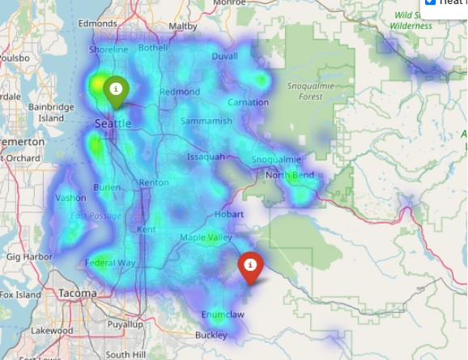
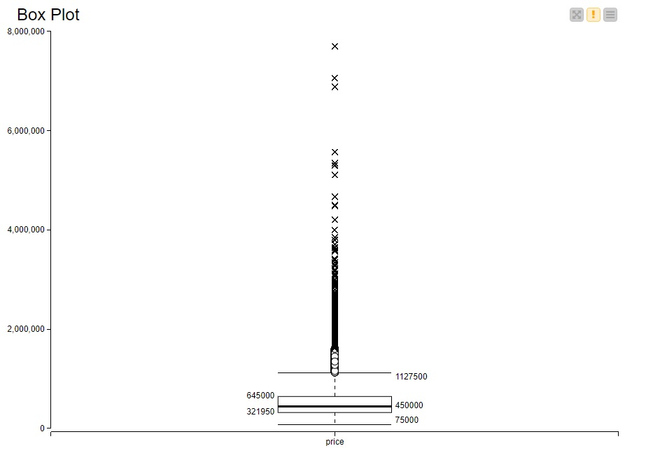
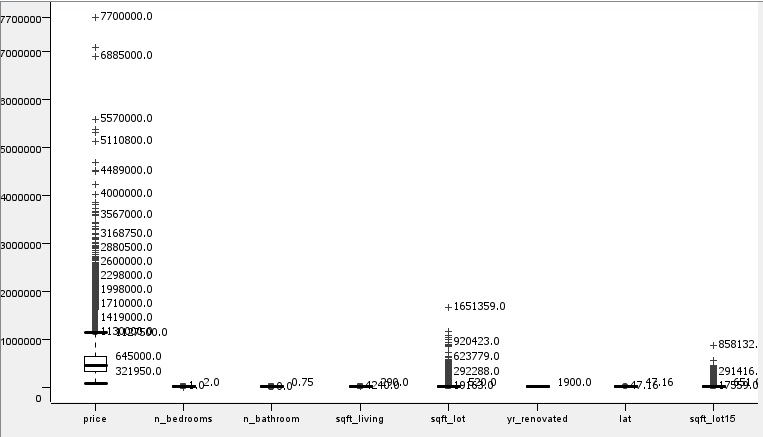
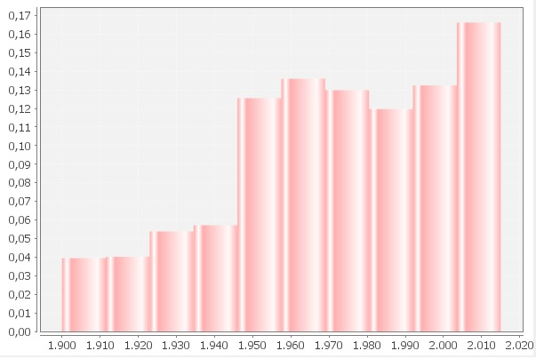
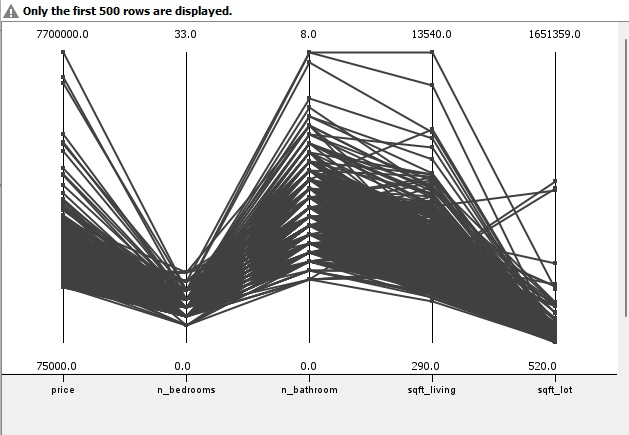
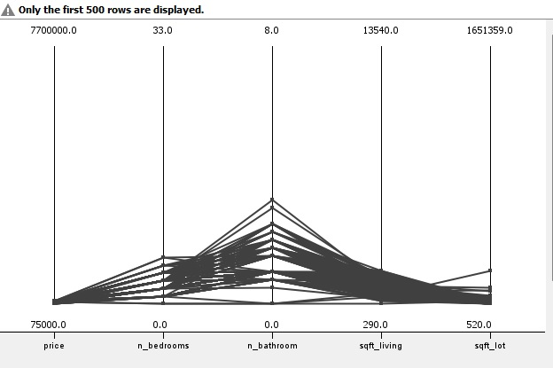

# Predicting King County houses' prices

<b>keywords</b>: supervised learning, linear regression, regression trees, multilayer perceptron, cluster analysis

## Introduzione
Il nostro studio nasce dalla curiosità di analizzare le caratteris- tiche del mercato immobiliare negli Stati Uniti negli anni 2014 e 2015, anni considerati interessanti in quanto caratterizzati dalla fine della crisi immobiliare iniziata nel 2006. La domanda di ricerca poste su cui questo articolo si concentrerà è: Quali sono le caratteristiche che più influenzano il prezzo di una proprietà?
Per rispondere alla domanda di ricerca è stato utilizzato il dataset disponibile sulla piattaforma [Kaggle](https://www.kaggle.com/): esso contiene i prezzi delle case vendute tra il Maggio 2014 e il Maggio 2015 nella Contea di King, la più popolosa all’interno dello Stato di Washington (Stati Uniti).

*<b>Fig. 1</b>. Mappa di densità delle proprietà in vendita e proprietà estreme: la più cara (in verde) e la meno cara (in rosso)*

Seattle è il capoluogo della Contea di King: con i suoi 750.000 abitanti, essa è la città più popolosa della Contea e tra città più popolose negli Stati Uniti. Il suo sviluppo lo ha portato ad essere tra le prime cinque città per aumento della popolazione fino al 2015 con una crescita annuale del 2,1% Questa impor- tanza è sicuramente data dalla sua posizione strategica: infatti, all’interno del territorio è presente il quarto porto più grande del Nord America considerato uno snodo fondamentale per il commercio asiatico. Inoltre, la città di Seattle offre un’altissima qualità della vita, possiede il numero più alto di laureati di tutti gli Stati Uniti (53,8%) ed è base di grandi aziende tecnologiche come Microsoft, Boeing, Amazon e Real Networks.
L’articolo è così costruito: inizialmente è stato introdotto il dataset, è stata fatta un’analisi preliminare sui dati e mostrata la fase di preprocessing; successivamente sono stati presentati i modelli utilizzati e, infine, sono state riportate le valutazioni ed i risultati ottenuti.

## Dataset

#### Descrizione variabili
Il dataset analizzato è composto da 21613 istanze e 21 attributi, ed è privo di valori mancanti. Di seguito l’elenco delle variabili originali, così come pervenute originariamente dalla fonte, con relativa descrizione:
* <i>id</i>: identificativo univoco dell’immobile venduto;
* <i>date</i>: data di vendita dell’immobile;
* <i>price</i>: prezzo dell’immobile venduto (in USD);
* <i>bedrooms</i>: numero di camere da letto;
* <i>bathrooms</i>: numero di bagni, dove 0.5 sta ad indicare un bagno con toilette ma senza doccia;
* <i>sqft_living</i>: metratura totale degli ambienti interni dell’immobile;
* <i>sqft_lot</i>: metratura dello spazio esterno dell’immobile;
* <i>floors</i>: numero di piani;
* <i>waterfront</i>: dummy variable per indicare se l’immobile è affacciato a sorgenti d’acqua;
* <i>view</i>: indice da 0 a 4 per indicare la qualità della vista dell’immobile;
* <i>condition</i>: indice da 1 a 5 segnalante la condizione dell’immobile;
* <i>grade</i>: indice da 1 a 13, dove 1-3 caratterizza immobili dalla costruzione e design insufficienti, 7 indica un livello di costruzione e design nella media e 11-13 denota un livello di costruzione e design alti;
* <i>sqft_above</i>: metratura dello spazio interno della casa che si trova sopra il livello del suolo;
* <i>sqft_basement</i>: metratura dello spazio interno della casa che si trova sotto il livello del suolo;
* <i>yr_built</i>: anno in cui l’immobile è stato costruito;
* <i>yr_renovated</i>: anno in cui l’immobile è stato restaurato l’ultima volta;
* <i>zipcode</i>: codice postale a cui l’immobile fa riferimento;
* <i>lat</i>: latitudine;
* <i>lon</i>: longitudine;
* <i>sqft_living15</i>: metratura degli interni dei 15 immobili più vicini;
* <i>sqft_lot15</i>: metratura dello spazio esterno dei 15 immobili più vicini;

#### Analisi Esplorativa dei dati

La prima attività svolte è stata quella di applicare il nodo “Ta- ble Manipulator” per poter osservare il nostro dataset. Prima di inserire il nostro file all’interno della piattaforma, abbiamo applicato alcuni cambiamenti direttamente sul file csv. Per au- mentare l’informatività abbiamo deciso di sostituire i valori ‘0’ dell’attributo yr_renovated, i quali stavano a rappresentare le case che non avevano subito ristrutturazioni, con il valore dell’anno dell’attributo yr_built eliminando in tal modo una colonna ren- dendo il dataset meno “pesante” in termine di computazione. Un’ulteriore modifica al dataset riguarda la creazione di una colonna restoration_time, la quale è stata generata dalla differenza tra l’attributo yr_renovated e yr_built per vedere meglio le case che hanno subito o meno una ristrutturazione e aumentare ancora di più l’informatività del nostro dataset. Abbiamo successivamente visualizzato informazioni ulteriori tramite analisi esplorativa in Python disponibile in questo [notebook](code/Preprocessing.ipynb).
Applicando il nodo “Statistics” abbiamo potuto vedere se gli attributi del nostro dataset presentassero dei valori asimmetrici oltre a permetterci di controllare anche l’eventuale presenza di
valori mancanti tra i nostri dati. Successivamente per studiare la variabile target ‘price’, abbiamo deciso di utilizzare un boxplot per osservare i suoi valori, come mediana, primo e secondo quar- tile e ovviamente il suo comportamento per quanto riguarda asimmetrie e outliers. Da ciò che appare si nota una forte asim- metria positiva con una coda molto lunga sulla parte superiore del boxplot.

*<b>Fig. 2</b>. Visualizzazione boxplot del prezzo.*

Abbiamo poi utilizzato i boxplot anche per valutare le altre
variabili nel nostro dataset:

*<b>Fig. 3</b>. Visualizzazione boxplot di tutte le variabili.*

Si nota dal grafico che tre delle nostre variabili a disposizione presentano asimmetria positiva: price, sqrt_lot e sqrt_lot15. Va- luteremo in seguito se sarà necessario applicare una trasfor- mazione logaritmica a queste variabili al fine di normalizzare la loro distribuzione ed eliminare di conseguenza la forte asimme- tria positiva. All’interno della sezione relativa al preproccessing spiegheremo come abbiamo trattato gli outliers nel dataset.
Inoltre, applicando il nodo “linear correlation” abbiamo valu- tato in linea generale, senza applicare correzioni, le correlazioni che esistono fra le nostre variabili, il che è molto importante per la previsione che dobbiamo fare, perché tenere all’interno del nostro dataset variabili eccessivamente correlate fra di loro comporterebbe l’inclusione del fenomeno della multicollinearità nei nostri modelli andando a distorcere la previsione.
Abbiamo inoltre deciso di controllare tramite un istogramma se ci fosse un aumento o una diminuzione di costruzioni di case nel corso degli anni. Il nostro dataset presenta case costruite nel periodo compreso tra 1900 e 2015 e si nota chiaramente che nel corso di questo periodo c’è stato un forte aumento del numero di case, probabilmente legato all’aumento della popolazione, come mostra il grafico:

*<b>Fig. 4</b>. Istogramma: numero di case costruite negli anni dal 1900 al 2015.*

Inoltre, abbiamo voluto studiare le 50 case più costose in relazione alle 50 case meno costose sulle variabili n_bedrooms, n_bathrooms, sqrt_living e sqrt_lot per capire se ci fosse un pattern ricorrente che influenzasse il prezzo. Dai grafici questo è ciò che si può notare:

*<b>Fig. 5</b>. 500 case più costose.*

*<b>Fig. 6</b>. 500 case meno costose.*

Le case più costose oltre ad un prezzo maggiore presentano anche un numero di elementi maggiori al loro interno come: un maggior numero di stanze da letto, di bagni, una metratura totale degli ambienti interni dell’immobile e una metratura dello spazio esterno dell’immobile sempre maggiore rispetto a quelle meno costose.

<u>*Please consult the report for details!*</u>

## License
[MIT](https://choosealicense.com/licenses/mit/)
